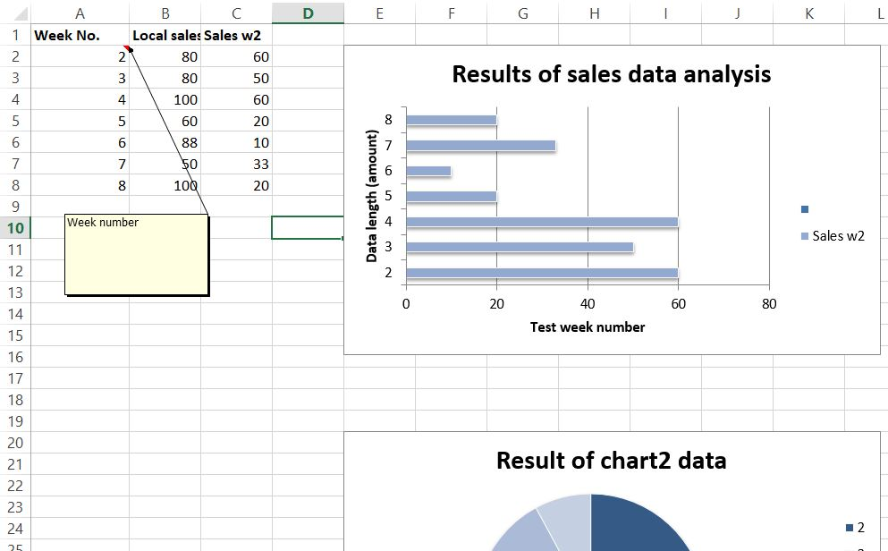

# Python-notebook

``` source listing ````
Visit https://xlsxwriter.readthedocs.io/



```
# import xlsxwriter module 
import xlsxwriter 
  
# Workbook() takes filename, non-optional ; hardcoded it for now
#  later, we can add arg options to specify output Excel filename 
workbook = xlsxwriter.Workbook('chart_new_bar2.xlsx') 
  
# To add new worksheet   
# worksheet via the add_worksheet() method. 
worksheet = workbook.add_worksheet() 
  
# Create a new Format object to formats cells 
# in worksheets using add_format() method . 
  
# here we create bold format object . 
bold = workbook.add_format({'bold': 1}) 
  
# create a data list . 
headings = ['Week No.', 'Local sales w1', 'Sales w2'] 
  
data = [ 
    [2, 3, 4, 5, 6, 7, 8], 
    [80, 80, 100, 60, 88, 50, 100], 
    [60, 50, 60, 20, 10, 33, 20], 
] 
# Write a row of data starting from 'A1' 
# with bold format . 
worksheet.write_row('A1', headings, bold) 
  
# Write a column of source data starting from 'A2', 'B2', 'C2' respectively
# Or let's enhance it with config profile
worksheet.write_column('A2', data[0]) 
worksheet.write_column('B2', data[1]) 
worksheet.write_column('C2', data[2]) 
worksheet.write_comment('A1', 'Week number')
  
# Create a chart object that can be added 
# to a worksheet using add_chart() method. 
  
# here we create a stacked bar chart object . 
chart1 = workbook.add_chart({'type': 'bar', 'subtype': 'stacked'}) 

chart2 = workbook.add_chart({'type': 'pie', 'subtype': 'stacked'})
  
# Add a data series to a chart 
# using add_series method. 
  
# Configure the first series. 
# = Sheet1 !$A$1 is equivalent to ['Sheet1', 0, 0]. 
chart1.add_series({ 
    'name':       '= Sheet1 !$B$1', 
    'categories': '= Sheet1 !$A$2:$A$8', 
    'values':     '= Sheet1 !$B$2:$B$8', 
}) 
  
# Configure a second series. 
# Note use of alternative syntax to define ranges. 
# [sheetname, first_row, first_col, last_row, last_col]. 
chart1.add_series({ 
    'name':       ['Sheet1', 0, 2], 
    'categories': ['Sheet1', 1, 0, 7, 0], 
    'values':     ['Sheet1', 1, 2, 7, 2], 
}) 

# Configure a second series.
# Note use of alternative syntax to define ranges.
# [sheetname, first_row, first_col, last_row, last_col].
chart2.add_series({
    'name':       ['Sheet1', 0, 2],
    'categories': ['Sheet1', 1, 0, 7, 0],
    'values':     ['Sheet1', 1, 2, 7, 2],
})
  
# Add a chart title  
chart1.set_title ({'name': 'Results of sales data analysis'}) 
  
# Add x-axis label 
chart1.set_x_axis({'name': 'Test week number'}) 
  
# Add y-axis label 
chart1.set_y_axis({'name': 'Data length (amount)'}) 
  
# Set an Excel chart style. 
chart1.set_style(11) 
  

###
# Add a chart2 title
chart2.set_title({'name': 'Result of chart2 data'})
chart2.set_x_axis({'name': 'Chart Sales '})
chart2.set_y_axis({'name': 'Sales amount'})
chart2.set_style(11)


# add chart to the worksheet  
# the top-left corner of a chart  
# is anchored to cell E2 .  
worksheet.insert_chart('E2', chart1) 
  
worksheet.insert_chart('E20', chart2)

# Finally, close the Excel file  
# via the close() method.  
workbook.close() 
```
